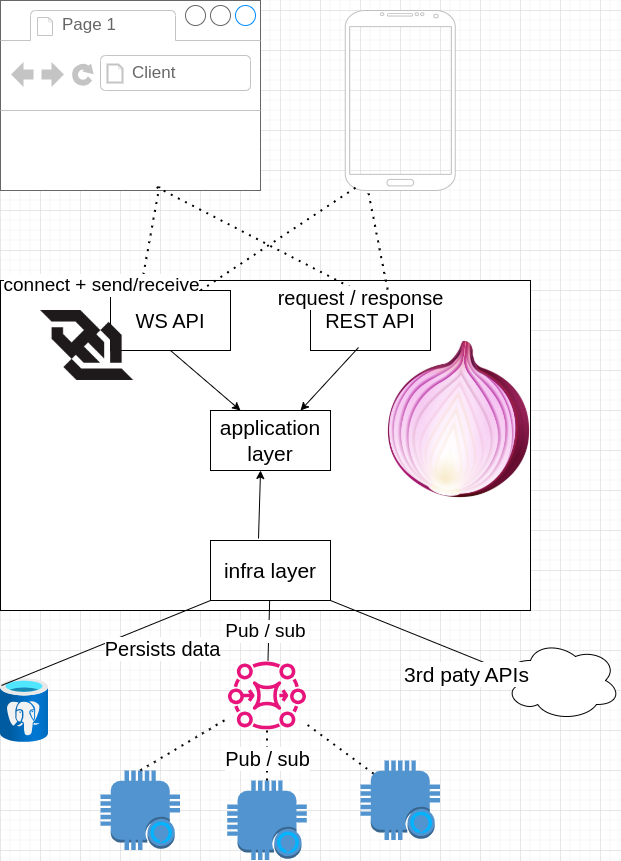
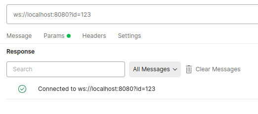

# Fullstack 2025 Minimalist template

Just the structure and bare necessitites

## Diagram overview



## Configuring AppOptions

For connectivity to services, please provide the following environment variables in appsettings.json or appsettings.Development.json in /server/Startup/

```
  "AppOptions": {
//optionally override the things from appsettings.json
//    "JwtSecret": "", //some random long string
//    "DbConnectionString": "", //MUST BE ENTITY FRAMEWORK FORMAT
//    "Seed": true,
//    "MQTT_BROKER_HOST": "", //optional only for IoT
//    "MQTT_USERNAME": "", //optional only for IoT
//    "MQTT_PASSWORD": "", //optional only for IoT
//    "PORT": 8080,
//    "WS_PORT": 8181,
//    "REST_PORT": 5000
  },
```

## Execution

### Backend with .NET CLI

Start backend can be started with `dotnet run` in server/Startup (make sure nothing is occupying port 8080 first)

### Backend with Docker

Start backend with Docker by building image using `docker build -t fs25 .` from the root project directory and then running with `docker run -p 8080:8080 fs25`

*Make sure to either configure appsettings.json or environment variables using naming APPOPTIONS__(keyname)=value before running.*

### Client app with Vite

Start client app with `npm install` & `npm run dev` in client/Startup

## Connection

Connect to the apy through the proxy on 8080 (no matter the protocol, http(s), ws(s), etc.). Examples from Postman:


